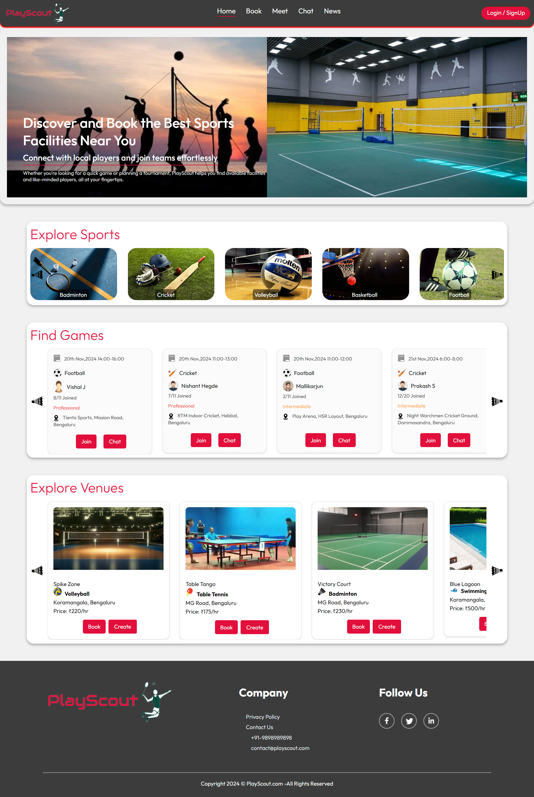

# PlayScout

**PlayScout** is a sports facility booking platform where users can explore venues, join games, and communicate with other players in real-time. This project leverages the **MERN stack** (MongoDB, Express, React, Node.js) with integrated real-time chat functionality.

> **Note**: Chat functionality has not been implemented yet.

## Features

- **Sports Facility Booking**: Search and book facilities for various sports.
- **Explore Players and Venues**: Browse players and venues via a responsive UI.
- **Real-Time Chat**: Connect with other players in game-specific chat rooms.
- **Authentication**: User registration and login with access to personalized features.
- **Admin Panel**: Admin registration which allows the user to add venues and manage them.
- **News**: Trending sports news received from GNews API
- **Responsive Design**: Optimized for mobile and desktop views.

## Home Page Preview



## Tech Stack

- **Frontend**: React, Socket.IO Client
- **Backend**: Node.js, Express, MongoDB, Socket.IO
- **Build Tool**: Vite

## Installation and Setup

### Prerequisites

- **Node.js** and **npm**
- **MongoDB** instance (local or cloud)

### Instructions

1. **Clone the repository**:

   ```bash
   git clone https://github.com/omkarh20/PlayScout.git
   cd PlayScout
   ```

2. **Backend**:

   - Go to the `backend` folder,
     (optional: set up a `.env` file with your `MONGO_URI` and `JWT_SECRET`) ,
     then start the server:

     ```bash
     cd backend
     npm install
     npm run server
     ```

3. **Frontend**:

   - Go to the `frontend` folder, install dependencies, then start the app:

     ```bash
     cd frontend
     npm install
     npm run dev
     ```

The frontend will run on `http://localhost:5173` and the backend on `http://localhost:4000` by default.

## Usage

1. **Sign Up/Login**: Create an account to access all features.
2. **Explore Venues and Players**: Scroll through lists and view details of available venues and players.
3. **Booking**: Select a venue, choose a time slot, and book.
4. **Meet**: Explore created games and join other players.
5. **Chat**: Chat with other participants in real-time.
6. **Admin**: Become an admin and add your own venue to the database.
7. **Upcoming**: Scroll through the venues you have booked or the games you have planned, and any requests received from other players.
8. **News**: Explore trending sports news.

---
