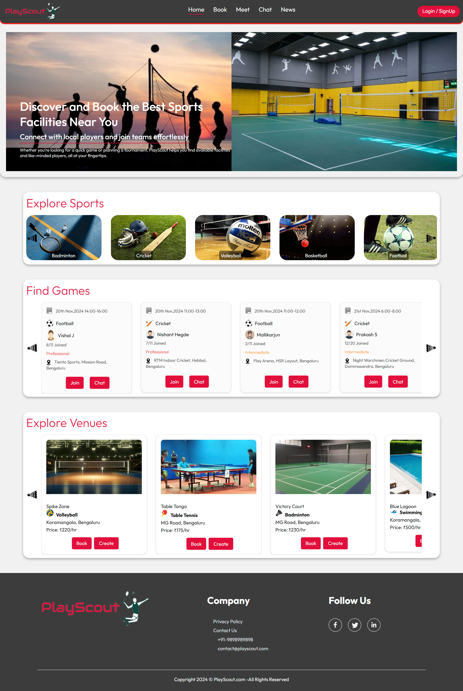

# PlayScout

**PlayScout** is a sports facility booking platform where users can explore venues, join games, and communicate with other players in real-time. This project leverages the **MERN stack** (MongoDB, Express, React, Node.js) with integrated real-time chat functionality.

The website is hosted at `https://playscout.onrender.com` - [PlayScout](https://playscout.onrender.com)
The backend is hosted at `https://playscout-backend.onrender.com` - [PlayScout-backend](https://playscout-backend.onrender.com)


## Features

- **Sports Facility Booking**: Search and book facilities for various sports.
- **Explore Players and Venues**: Browse players and venues via a clean UI.
- **Real-Time Chat**: Connect with other players to discuss plans for a booked game.
- **Authentication**: User registration and login with access to personalized features.
- **Admin Panel**: Admin registration which allows the user to add venues and manage them.
- **News**: Trending sports news received from GNews API

## Home Page Preview



The rest of the website previews are in the previews folder

## Tech Stack

- **Frontend**: React, Socket.IO Client
- **Backend**: Node.js, Express, MongoDB, Socket.IO
- **Build Tool**: Vite

## Installation and Setup

### Prerequisites

- **Node.js** and **npm**
- **MongoDB** instance (local or cloud)

### Instructions

1. **Clone the repository**:

   ```bash
   git clone https://github.com/omkarh20/PlayScout.git
   cd PlayScout
   ```

2. **Backend**:

   - Go to the `backend` folder,
   - Create a `.env` file with your MongoDB URI, JWT secret, Google News API key, backend url and frontend url. The file should look like this:
   > You can also use the frontend and backend urls mentioned in the beginning.
     ```env
     JWT_SECRET="random#secret"
     MONGO_URI="mongodb+srv://<username>:<password>@<cluster>.mongodb.net/?retryWrites=true&w=majority"
     G_API_KEY="yourapikey"
     REACT_APP_BACKEND_URL=http://localhost:4000
     REACT_APP_FRONTEND_URL=http://localhost:5173
     ```

   - Install dependencies and start the server:

     ```bash
     npm install
     npm run server
     ```

3. **Frontend**:

   - Go to the `frontend` folder,
   - Create a `.env` file with the backend and frontend URLs:
   > Again, you can also use the frontend and backend urls mentioned in the beginning.

     ```env
     VITE_BACKEND_URL=http://localhost:4000
     VITE_FRONTEND_URL=http://localhost:5173
     ```

   - Install dependencies and start the app:

     ```bash
     npm install
     npm run dev
     ```

## Usage

1. **Sign Up/Login**: Create an account to access all features.
2. **Explore Venues and Players**: Scroll through lists and view details of available venues and players.
3. **Booking**: Select a venue, choose a time slot, and book.
4. **Meet**: Explore created games and join other players.
5. **Chat**: Chat with other participants in real-time.
6. **Admin**: Become an admin and add your own venue to the database.
7. **Upcoming**: Scroll through the venues you have booked or the games you have planned, and any requests received from other players.
8. **News**: Explore trending sports news.

---
